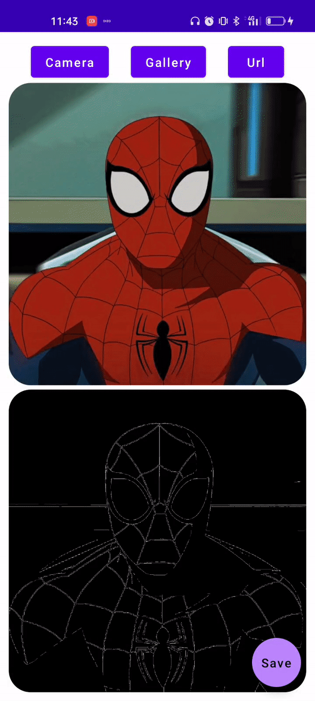
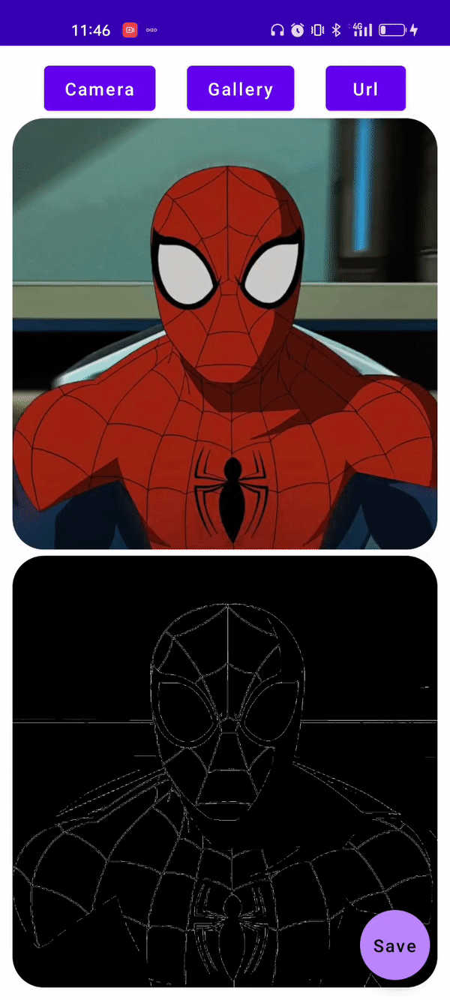

A simple android application to detect edges in an imgage using [Canny Algorithm](https://docs.opencv.org/4.x/da/d22/tutorial_py_canny.html)

## Made with modern android development tools:

- [Kotlin](https://developer.android.com/kotlin)

- [Jetpack Compose](https://developer.android.com/jetpack/compose)

- [Open CV](https://opencv.org/releases/)

- [Room DB](https://developer.android.com/jetpack/androidx/releases/room)

## Features:

- Click image from camera

- Select image from Gallery

- Use image url 

## Screenshots:
<table>
  <tr>
     <td>Camera</td>
     <td>Gallery</td>
     <td>Image Url</td>
  </tr>
  <tr>
    <td></td>
    <td></td> 
    <td></td>
  </tr>
 </table>
